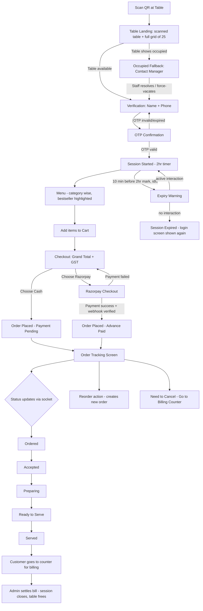
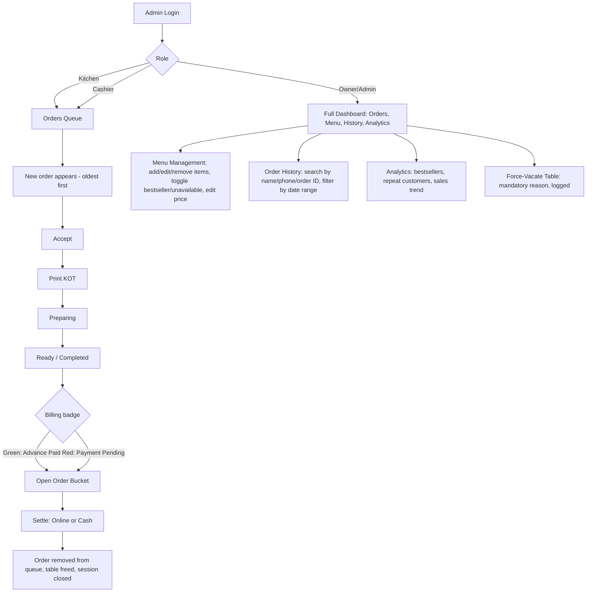
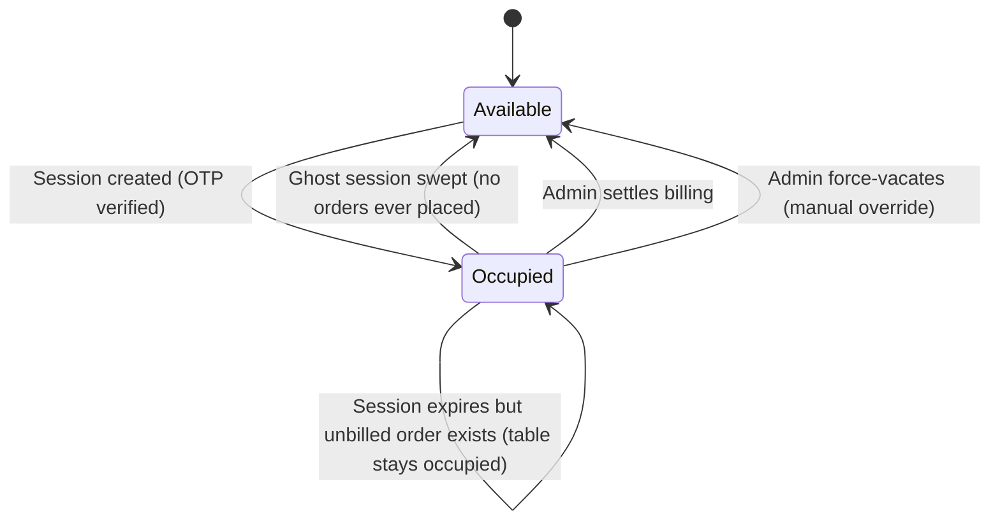

# App Flow
## Project: QR-Based Table Ordering & Billing System — "Chai Partner"

This document maps every screen-to-screen transition for both the customer app and the admin/kitchen/cashier dashboard, including edge cases.

---

## 1. Customer Flow

### 1.1 Step-by-step with edge cases

1. **Scan QR** → resolves signed per-table token.
2. **Table Landing** → shows scanned table + status grid of all 25 tables.
   - *Edge case:* table shows occupied but customer is physically there → **Occupied Fallback** screen with manager name/phone + "Notify Staff" button (pushes a real-time alert to admin dashboard).
3. **Verification** → name + phone → OTP sent.
   - *Edge case:* OTP not received → resend with cooldown timer (rate-limited).
   - *Edge case:* wrong OTP 3x → temporary lockout, "Contact staff" fallback.
4. **Session starts** → table marked occupied, 2-hour timer begins.
5. **Menu** → category tabs, bestseller badges, unavailable items disabled.
6. **Cart → Checkout** → grand total with GST shown separately.
   - *Edge case:* item price changed by admin mid-session → cart still honors the price at time of adding (server snapshots on order placement, not on add-to-cart, so this is resolved at the moment "Place Order" is tapped).
7. **Payment** → Razorpay or Cash.
   - *Edge case:* Razorpay payment fails/cancelled → return to checkout, no order created.
   - *Edge case:* network drops after payment success but before confirmation screen loads → idempotency key ensures no duplicate order; on reconnect, tracking screen resolves to the correct existing order.
8. **Order Tracking** → live timeline; **Reorder** creates a fresh order (not a reopened one).
   - *Edge case:* customer wants to cancel an advance-paid order → directed to billing counter; staff processes cancellation + logs refund reason in-system.
9. **Session expiry** → warning banner 10 minutes before 2-hour mark; auto-extends if user is actively interacting; otherwise expires and returns to verification screen. Table itself stays occupied if there's an unbilled order — only frees when admin completes billing.
10. **Billing** → customer approaches counter; admin opens their order bucket, settles (online/cash), table frees and session formally closes.

---

## 2. Admin / Kitchen / Cashier Flow

### 2.1 Step-by-step with edge cases

1. **Login** → role-based landing (kitchen/cashier see Orders only; owner sees full dashboard).
2. **Orders Queue** → sorted oldest-first, real-time push on new orders.
   - *Edge case:* two staff devices try to Accept the same order simultaneously → guarded transaction ensures only the first succeeds; second sees "Already accepted by [name]."
3. **Accept → Print KOT** → sends to kitchen printer.
4. **Preparing → Ready/Completed** → customer's tracking screen updates live.
5. **Billing** → badge reflects payment status; opening it shows itemized bucket for that session/table.
   - *Edge case:* customer wants to pay differently than pre-selected (e.g., chose cash but wants to pay online at counter) → cashier can override payment method at settlement.
6. **Settle** → marks paid, closes session, frees table — this is the **only** action that frees a table with an unbilled order attached.
7. **Menu Management** → changes apply to future orders only (existing order snapshots unaffected).
8. **Order History** → full searchability for disputes/reporting.
9. **Analytics** → aggregate views, refreshed periodically (not necessarily real-time).
10. **Force-Vacate** → used when a session is stuck (customer left without ordering, app crash, stale QR photo scenario) — requires a reason, logged to audit trail, immediately frees the table for the next customer.

---

## 3. Cross-Cutting Flow: Table Status Lifecycle

