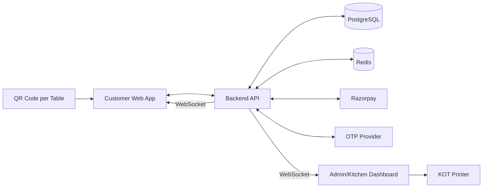

# Technical Requirement Document (TRD)
## Project: QR-Based Table Ordering & Billing System — "Chai Partner"

**Version:** 1.0
**Companion docs:** PRD.md, App-Flow.md, UI-UX-Design-Brief.md, BRAIN.md

---

## 1. Tech Stack

| Layer | Choice | Notes |
|---|---|---|
| Customer web app | Next.js (React), PWA-enabled | Installable, fast load, works across mobile/tablet/PC |
| Admin/Kitchen dashboard | Same Next.js app, `/admin` route group with RBAC guard | Shared component library with customer app for consistency |
| Backend API | Node.js + NestJS (or Express) | REST endpoints + WebSocket gateway |
| Real-time | Socket.io | Order status push, table-status push, admin queue updates |
| Database | PostgreSQL | Relational integrity for orders/sessions/payments |
| Cache / ephemeral state | Redis | Session TTLs, OTP codes, rate-limit counters, table locks |
| Payments | Razorpay (Orders API + Webhooks) | Signature-verified server-side |
| SMS/OTP | Provider with India coverage (e.g., MSG91 / Twilio Verify) | Use provider's Verify API, not hand-rolled OTP storage |
| File storage | S3-compatible bucket | Menu item images |
| Hosting | Docker containers on cloud VM / PaaS | Managed Postgres + managed Redis |
| Monitoring | Basic APM + error tracking (e.g., Sentry) | Required before production launch |

---

## 2. System Architecture



---

## 3. Data Model

| Table | Key Fields |
|---|---|
| **tables** | id, table_number, seat_count, status, current_session_id, qr_token (signed, rotatable) |
| **sessions** | id, table_id, customer_name, phone (encrypted), email (nullable), otp_verified_at, started_at, expires_at, status |
| **menu_categories** | id, name, sort_order |
| **menu_items** | id, category_id, name, description, price, image_url, is_bestseller, is_available, veg_flag |
| **orders** | id, session_id, table_id, order_number, status, payment_status, created_at |
| **order_items** | id, order_id, menu_item_id, qty, unit_price (snapshot, immutable) |
| **payments** | id, order_id, method, razorpay_order_id, razorpay_payment_id, amount, status |
| **refunds** | id, payment_id, amount, reason, processed_by, timestamp |
| **admin_users** | id, name, role (admin/kitchen/cashier), phone/email, password_hash |
| **audit_log** | id, actor_id/type, action, entity, entity_id, timestamp |
| **idempotency_keys** | id, session_id, key, response_snapshot, created_at |

Key constraints:
```sql
CREATE UNIQUE INDEX one_active_session_per_table
  ON sessions (table_id) WHERE status = 'active';

CREATE UNIQUE INDEX one_idempotent_order
  ON idempotency_keys (session_id, key);
```

---

## 4. Order & Session State Machines

**Order status:** `placed → accepted → preparing → ready → served → billed` (+ `cancelled`, `cancellation_requested`)
**Payment status:** `pending → advance_paid → paid` (+ `refund_pending → refunded`)
**Session status:** `active → expired → closed`

All transitions go through guarded, transactional updates (`WHERE status = <expected_current>`), never blind writes — see BRAIN.md §"Non-negotiable engineering rules."

---

## 5. Key API Endpoints (representative, not exhaustive)

| Endpoint | Method | Purpose |
|---|---|---|
| `/tables` | GET | Live status of all tables |
| `/tables/:token/resolve` | GET | Resolve scanned QR token to a table |
| `/sessions/verify/request-otp` | POST | Send OTP to phone |
| `/sessions/verify/confirm-otp` | POST | Confirm OTP, create session |
| `/menu` | GET | Categorized menu with availability/bestseller flags |
| `/orders` | POST | Place order (requires `Idempotency-Key` header) |
| `/orders/:id/status` | PATCH (admin) | Transition order status |
| `/payments/razorpay/order` | POST | Create Razorpay order |
| `/payments/razorpay/webhook` | POST | Razorpay webhook receiver (signature verified) |
| `/admin/menu-items` | CRUD | Menu management |
| `/admin/orders/history` | GET | Filter/search past orders |
| `/admin/analytics/*` | GET | Sales/bestseller/repeat-customer aggregates |
| `/admin/tables/:id/force-vacate` | POST | Manual override, requires reason |

---

## 6. Real-Time Events (Socket.io)

| Event | Direction | Payload |
|---|---|---|
| `table:status_changed` | Server → Customer app (table grid) | table_id, status |
| `order:status_changed` | Server → Customer (tracking screen) | order_id, new_status |
| `order:new` | Server → Admin dashboard | full order object |
| `order:updated` | Server → Admin dashboard | order_id, changed fields |
| `session:expiring_soon` | Server → Customer | session_id, minutes_remaining |

Client reconnect strategy: exponential backoff + full REST resync on reconnect (never trust socket state alone after a gap).

---

## 7. Security Requirements

- Signed, per-table QR tokens (JWT or HMAC-signed random token), rotatable if compromised.
- Phone numbers encrypted at rest; only last 4 digits shown in admin UI unless full detail is required.
- OTP handled via provider's Verify API (rate-limited, brute-force protected).
- Razorpay payments verified via both signature check (client path) and webhook (source of truth).
- Admin auth: hashed passwords (bcrypt/argon2) + role-based access control (admin/kitchen/cashier scopes).
- All state-changing admin actions logged to `audit_log`.

---

## 8. Performance & Reliability Requirements

- Menu/order screens: < 2s load on typical cafe network.
- Idempotent order submission via `Idempotency-Key` header.
- Redis-backed rate limiting: OTP requests, table-claim attempts.
- Ghost-session sweeper job (cron or Redis keyspace notification) reconciling expired-but-unbilled sessions.
- Daily reconciliation report: orders with `payment_status = pending` beyond a threshold age.

---

## 9. Infrastructure & Deployment

- Dockerized services: `web` (Next.js), `api` (NestJS), `worker` (sweeper/cron jobs).
- Managed Postgres and Redis (avoid self-hosting stateful services early on).
- CI/CD: lint + test + build on push; staged deploy (staging → production).
- Environment separation: `.env` per environment, secrets never committed (see BRAIN.md).
- Error tracking (Sentry or equivalent) wired in from Phase 1.

---

## 10. Non-Functional Requirements Summary

- **Responsive** across mobile, tablet, PC (see UI-UX-Design-Brief.md for breakpoints).
- **Resilient** to flaky customer Wi-Fi (idempotency, socket resync).
- **Auditable** (every money-affecting action logged).
- **Extensible** without hardcoding table count, category list, or role set.
